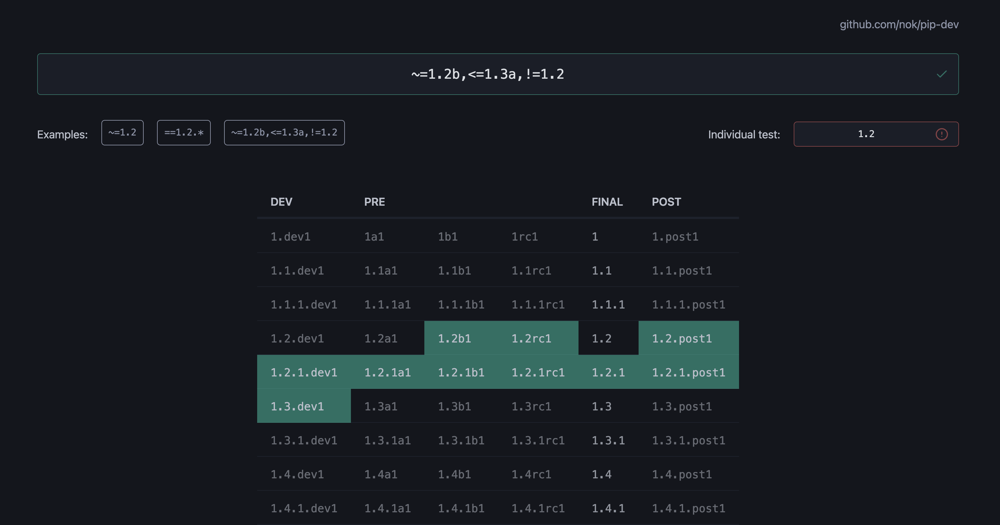

  

<h1 align="center">pip-dev</h1>

An interactive tool for developers to test defined specifiers for version handling.

## Development

The results are based on the amazing package [pypa/packaging](https://github.com/pypa/packaging). For more details read the official specification [Version Identification and Dependency Specification (PEP 440)](https://peps.python.org/pep-0440/).

## Examples

Do you know the difference between `>=1.4.5`, `~=1.4.5` and `==1.4.*`?

- [nok.github.io/pip-dev?spec=>=1.4.5&vers=1.4.5](https://nok.github.io/pip-dev?spec=>=1.4.5&vers=1.4.5)
- [nok.github.io/pip-dev?spec=~=1.4.5&vers=1.4.5](https://nok.github.io/pip-dev?spec=~=1.4.5&vers=1.4.5)
- [nok.github.io/pip-dev?spec===1.4.*&vers=1.4.5](https://nok.github.io/pip-dev?spec=~=1.4.*&vers=1.4.5)

Do you know the difference between `~=1.4.5` and `>=1.4.5,==1.4.*`?

- [nok.github.io/pip-dev?spec=~=1.4.5&vers=1.4.5](https://nok.github.io/pip-dev?spec=~=1.4.5&vers=1.4.5)
- [nok.github.io/pip-dev?spec=>=1.4.5,==1.4.*&vers=1.4.5](https://nok.github.io/pip-dev?spec=>=1.4.5,==1.4.*&vers=1.4.5)

And what about `~=1.2b,<=1.3a,!=1.2`?

- [nok.github.io/pip-dev?spec=~=1.2b,<=1.3a,!=1.2&vers=1.2.1](https://nok.github.io/pip-dev?spec=~=1.2b,<=1.3a,!=1.2&vers=1.2.1)

## License

The package is Open Source Software released under the [BSD 3-Clause License](LICENSE).
